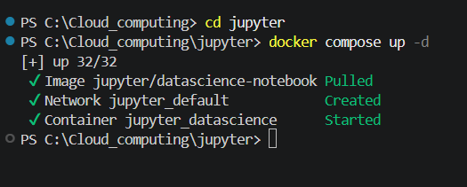

# Practicas de ASO

## Administración de Sistemas Informáticos

### MarkDown

Esto es texto normal. Puedo poner **negrita** y *cursiva*, o ***las dos juntas***.

Imprimimos en Python con `print()`.

``` python
a = 'Hola mundo de informatica'
print(a)
```

## Listas

1. Primer elemento
2. Segundo elemento

- Primer elemento
  - Segundo elemento
  
## Tablas

| Primera columna | Segunda columna | Tercera columna |
|---------------- | --------------- | --------------- |
| elemento1       | elemento 2      | elemento 3      |
| elemento1       | elemento 2      | elemento 3      |
| elemento1       | elemento 2      | elemento 3      |

## Imágenes

Copia-pega captura o imagen


## Enlaces

[texto del enlace](ruta o enlace)
