# PR0201: Administración remota con Powershell

En esta práctica vamos a realizar tareas de administración remota de un servidor en modo Core utilizando Powershell.

## 1. Entorno virtualizado

Necesitarás la siguiente configuración de máquinas virtuales:

- Windows Server 2019 con experiencia de escritorio
- Windows Server 2019 en modo Core
- Windows Server 2019 en modo Core

Utilizando el comando para cambiar el nombre del equipo:

```python
Rename-Computer -NewName JSG-2019 -Restart
```

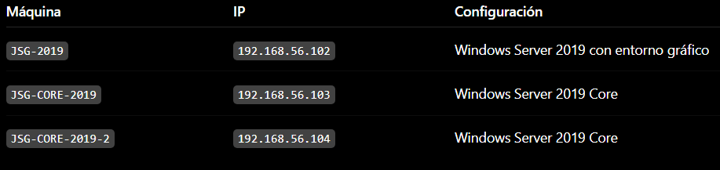

Todos los equipos tendrán que tener un adaptador en modo solo-anfitrión en la misma red y otro en modo NAT por si necesitaras acceso a Internet.

## 2. Preparación de las máquinas

- Comprueba la conectividad entre los tres equipos:
- Asigna nombres a los equipo, estos nombres serán:
  - Windows Server 2019 con entorno gráfico: {INICIALES}-2019
  - Windows Server 2019 en modo core: {INICIALES}-CORE-2019
  - Windows Server 2016 en modo core: {INICIALES}-CORE-2016
- Edita el fichero hosts de cada equipo para la habilitar la resolución local de nombres entre ellos
Primero editamos el archivo C:\Windows\System32\drivers\etc\hosts para añadir las ip y nombres de los equipos con el siguiente comando:

```python
notepad C:\Windows\System32\drivers\etc\hosts
```

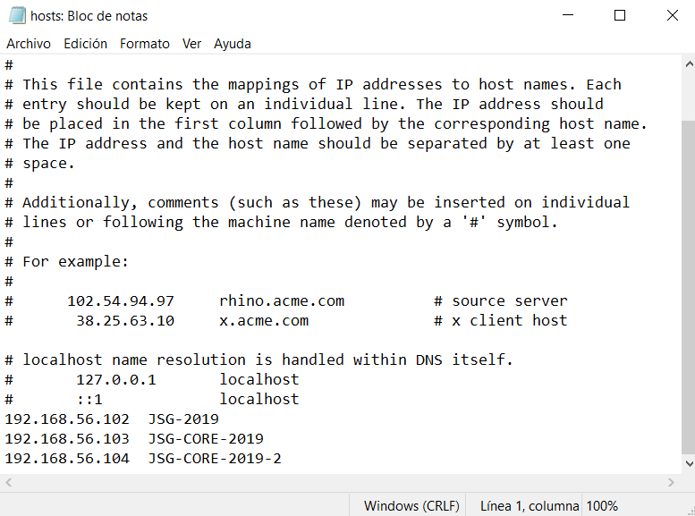

Conseguí hacer ping usando el siguiente comando para permitir el ping en el firawall:

 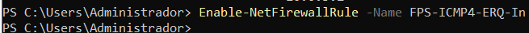

 ---

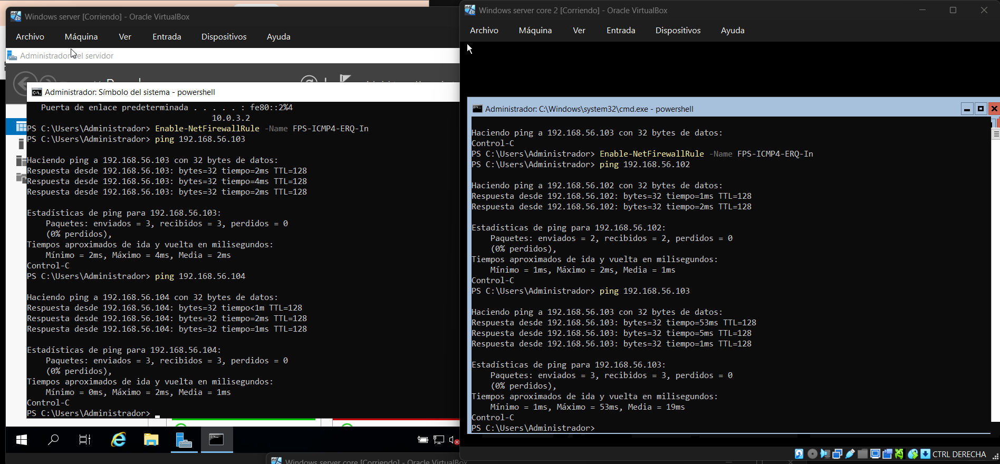

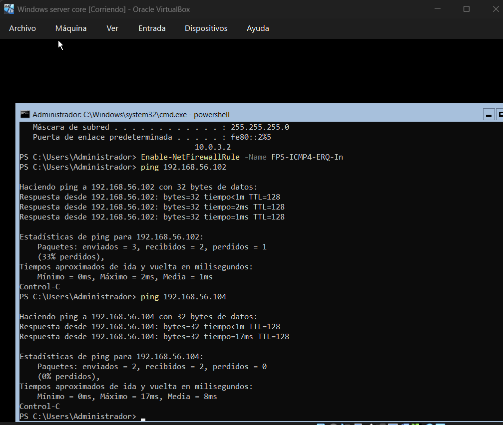

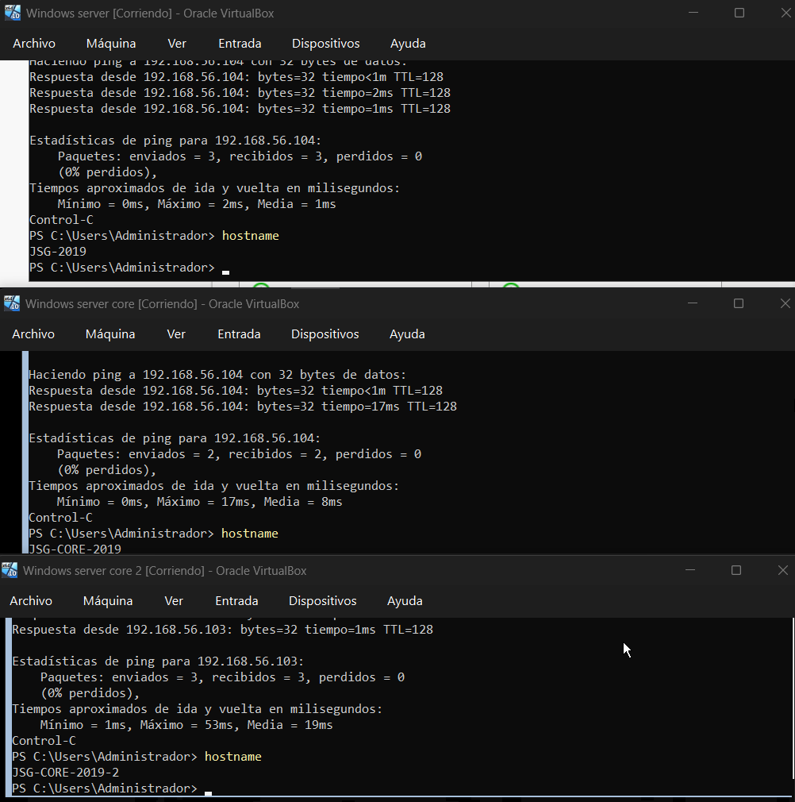

Vemos que hace ping incluso poniendo el nombre:
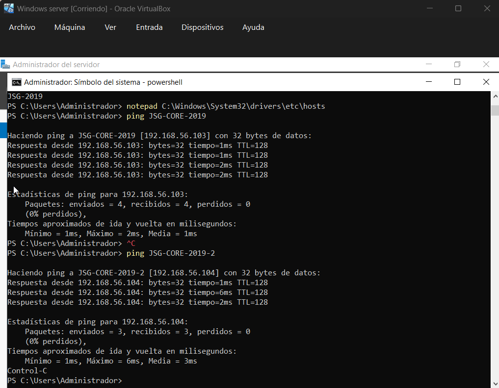

## 3. Configuración del acceso remoto al nuevo equipo

El objetivo es realizar los pasos necesarios para administrar los dos equipos en modo Core desde el equipo con entorno gráfico.

Para comprobar que funciona crea, desde el equipo con entorno gráfico, un usuario con privilegios de administrador llamado admin_{iniciales}.

Con el comando:

```python
winrm get winrm/config/client
```

Y tenemos que ver como respuesta, en este caso:

```python
TrustedHosts = 192.168.56.103,192.168.56.104
```

Creamos el usuario admin_JSG con contraseña y todo lo necesario
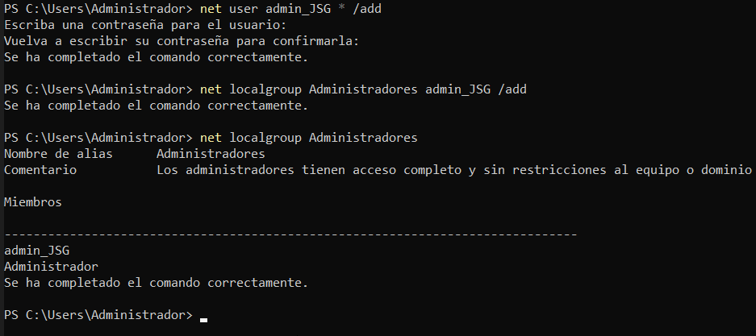

Comprobamos las listeners con:

```python
winrm enumerate winrm/config/listener
```

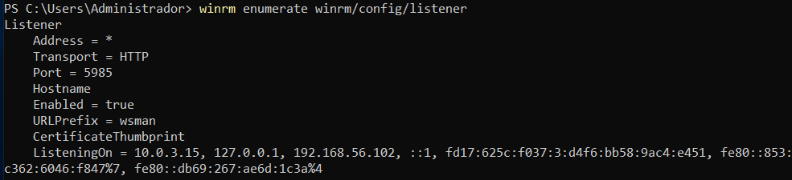

Activamos WinRM (Powershell Remoting) en los dos core.
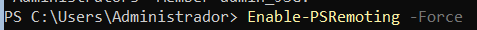

Ahora en JSG-2019 ponemos a los otros servidores de confianza.
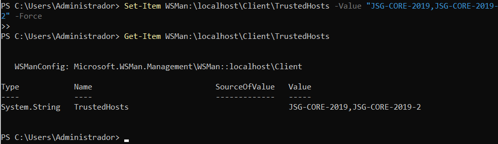
Y comprobamos que se han guardado.

Con el comando:
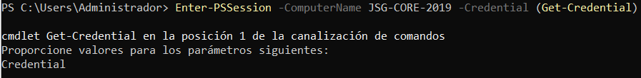

Accedemos a uno de los core usando la contraseña y el usuario:
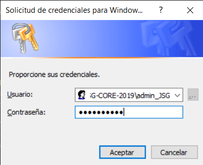

Si está todo correcto y funciona nos saldria lo siguiente:
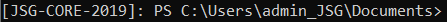


## 4. Configuración del acceso remoto sobre HTTPS

- Una vez que hayas comprobado que tienes todo bien configurado es el momento de asegurar nuestra red preparándola para que utilice WinRM sobre HTTPS utilizando un certificado autofirmado

- Realiza los pasos necesarios para que la comunicación con ambos servidores utilice este mecanismo

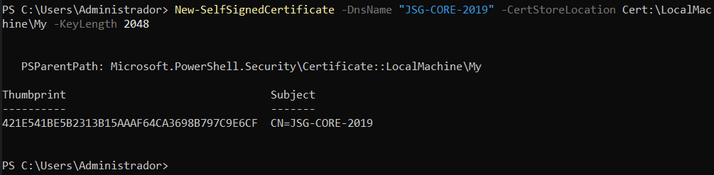
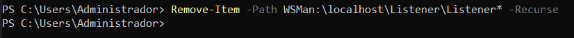
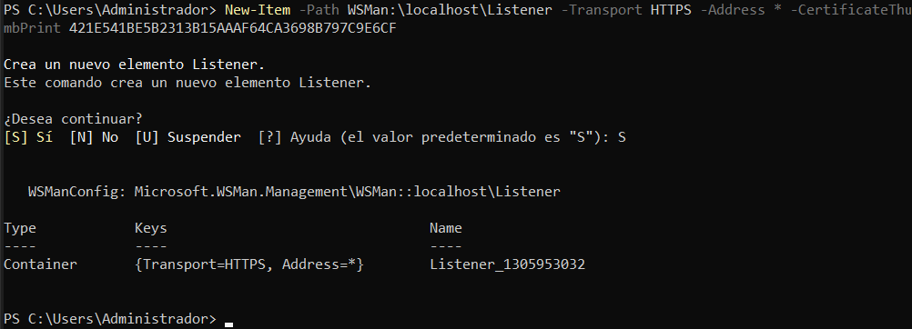

Abrimos el puerto 5986 en el firewall:
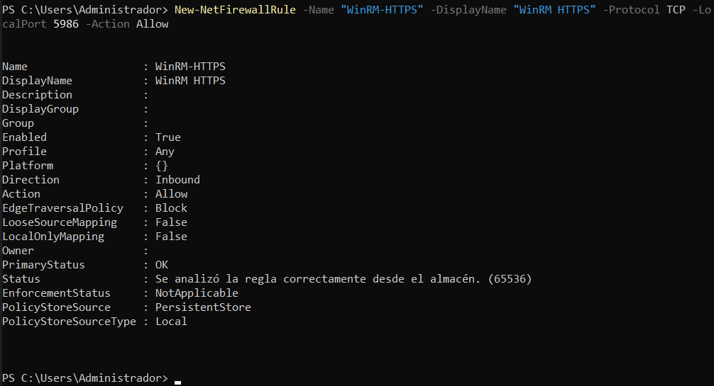

Comprobamos el listener:
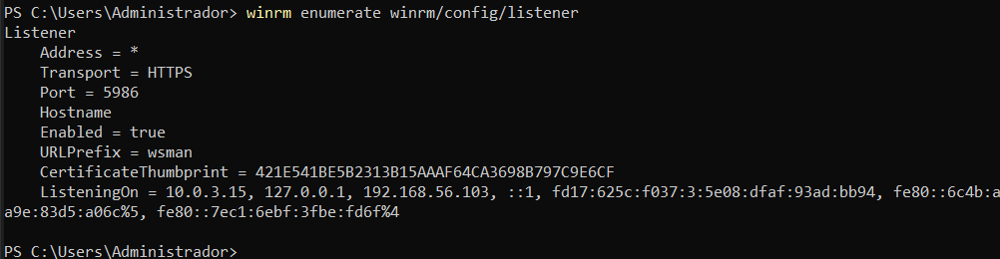

Con el siguiente comando exportamos certificados:
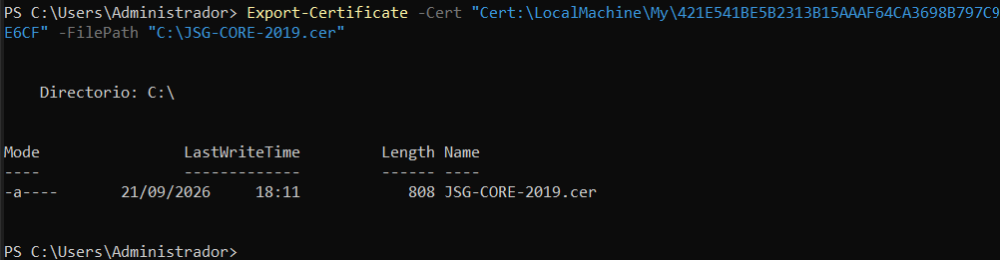

Esto lo hacemos en ambos core con el código correspondiente.

Los certificados se guardan en:

```python
Cert:\LocalMachine\My
```

Y para consultar los certificados:

```python
Get-ChildItem Cert:\LocalMachine\My\
```

El listener HTTPS utiliza:

```python
Puerto: 5986
Transporte: HTTPS
```

Ahora desde Window Server(JSG-2019) ponemos lo siguiente:

Creamos la conexión HTTPS:
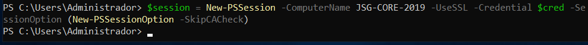
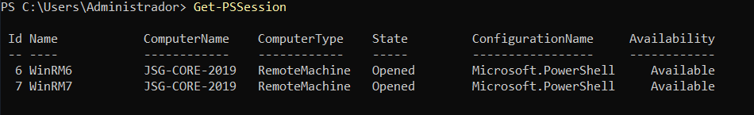
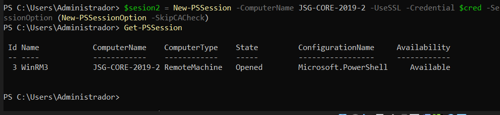

Comprobamos el certificado desde los core:

```python
Get-ChildItem Cert:\LocalMachine\My\
```

Y exportamos los certificados:

```python
Export-Certificate -Cert "Cert:\LocalMachine\My\421E541BE5B2313B15AAAF64CA3698B797C9E6CF" -FilePath "C:\JSG-CORE-2019.cer"
----------------------------------
Export-Certificate -Cert "Cert:\LocalMachine\My\7B5468AE27EBC417729594957734B2144A20DAA8" -FilePath "C:\JSG-CORE-2019-2.cer"
```

Creamos una carpeta compartida (C:\Compartida)

```python
New-Item -Path C:\Compartida -ItemType Directory
```

Ahora creamos el recurso compartido:

```python
New-SmbShare -Name compartida -Path C:\Compartida -FullAccess "Administradores"
```

Para comprobarlo:

```python
Get-SmbShare -Name compartida
```

La carpeta es accesible mediante:

```python
\\192.168.56.102\compartida
```

Desde los core copiamos los certificados a la carpeta compartida:

```python
Copy-Item -Path C:\JSG-CORE-2019.cer -Destination "\\192.168.56.102\compartida\"
-----------------------------------
Copy-Item -Path C:\JSG-CORE-2019.cer -Destination "\\192.168.56.102\compartida\"
```

Desde el servidor gráfico importamos los certificados de la carpeta compartida:

```python
Import-Certificate -FilePath C:\Compartida\JSG-CORE-2019.cer -CertStoreLocation Cert:\LocalMachine\Root
---------------------------------------
Import-Certificate -FilePath C:\Compartida\JSG-CORE-2019-2.cer -CertStoreLocation Cert:\LocalMachine\Root
```

Comprobamos que WinRM se comunica:

```python
Test-WSMan JSG-CORE-2019 -UseSSL
--------------------------------
Test-WSMan JSG-CORE-2019-2 -UseSSL
```

## 5. Configuración remota con Windows Admin Center

Por último, configura tus equipos para poder administrarlos de forma remota utilizando Windows Admin Center desde el equipo con entorno gráfico.

Instalamos Windows Admin Center en Windows Server (JSG-2019)
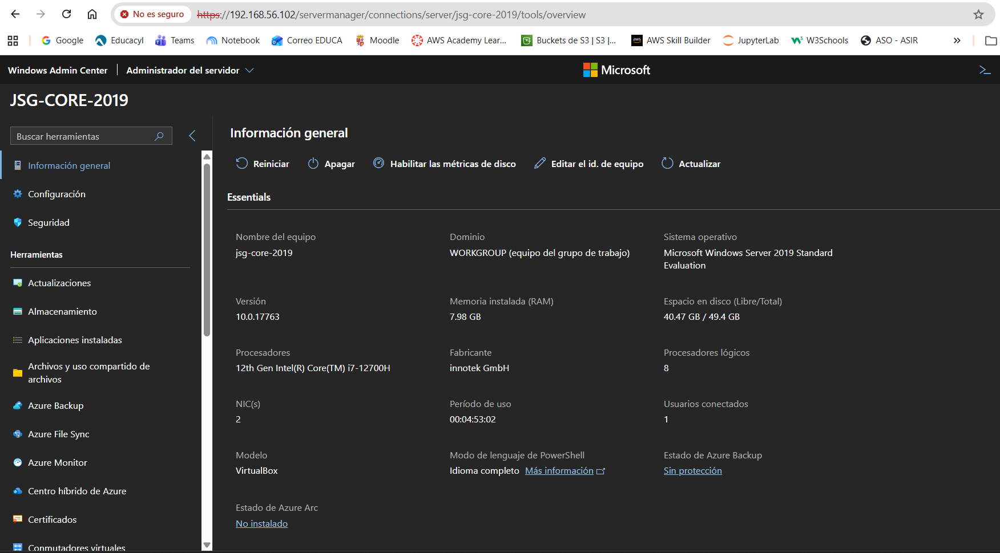
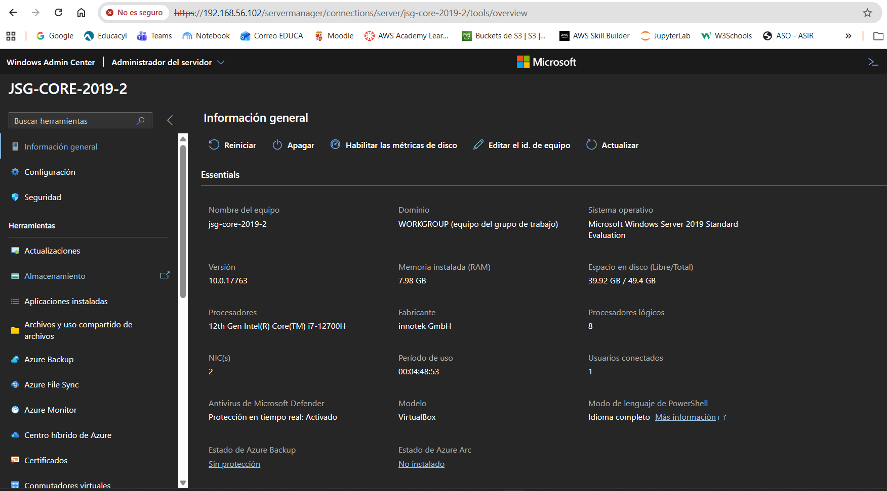

La red sería algo asi:
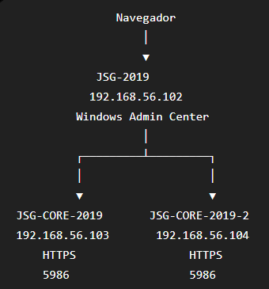

Ahora desde cliente (nuestro pc) entraríamos en <https://192.168.56.102/> o e introduciendo las credenciales podriamos acceder al WAC.

Introducimos nuestras credenciales, que en este caso son:

```python
Usuario: JSG-2019\Administrador
Contraseña: *********
```

Ahí añadiriamos manualmente los dos core.
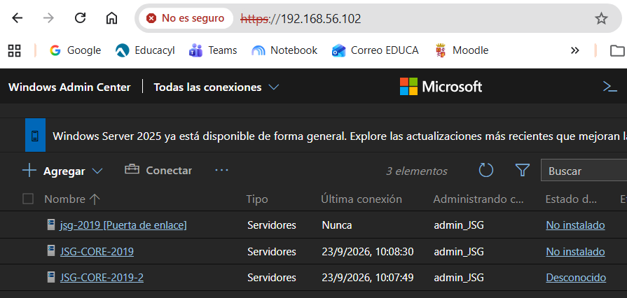

## 6. Documentación

Tienes que documentar los pasos más relevantes que has seguido para realizar la práctica y subirlo a tu repositorio Github
