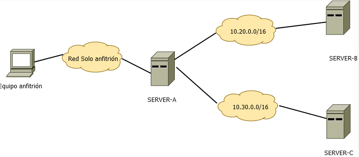
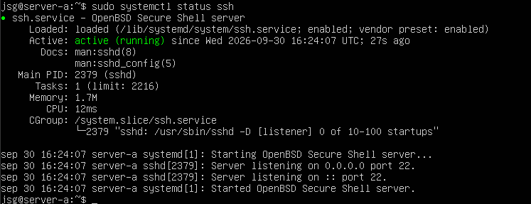
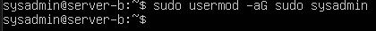
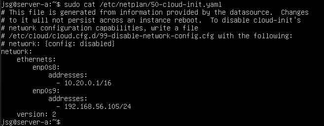
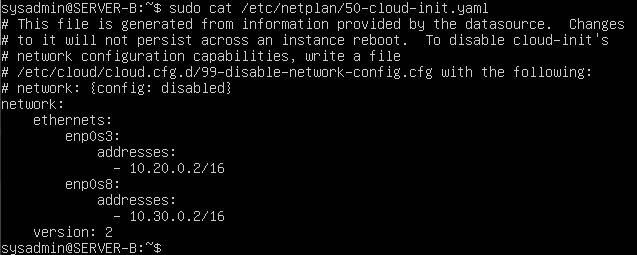
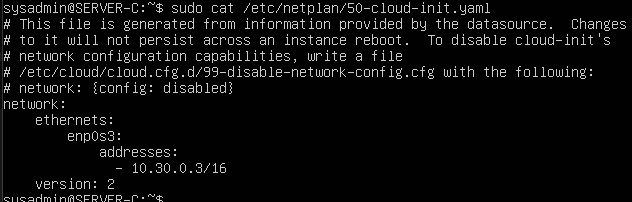
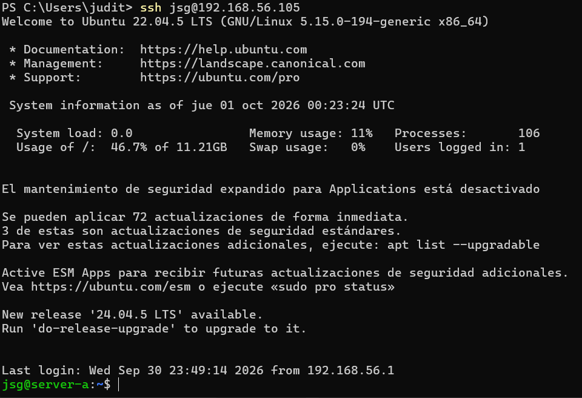
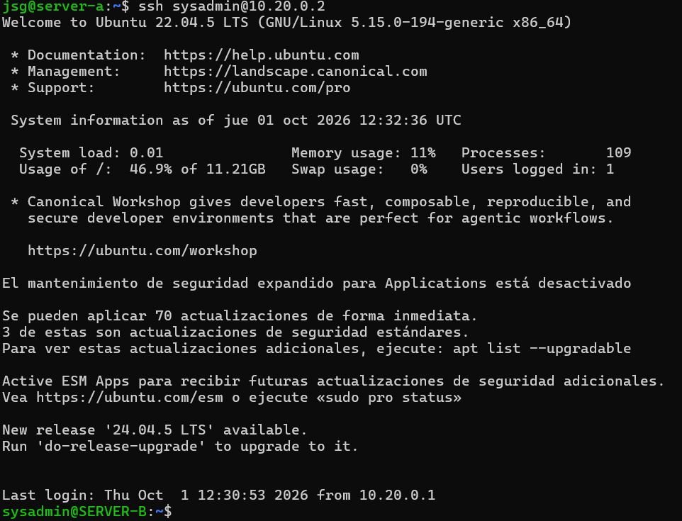
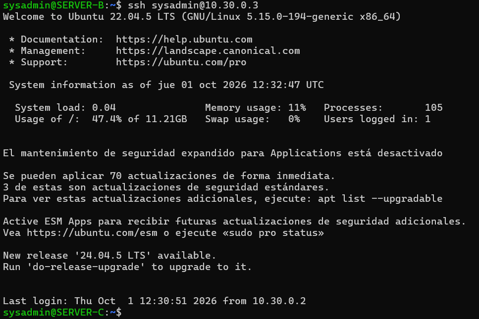

# PR0202: El protocolo SSH

## Entorno de trabajo

En esta práctica tienes que preparar un entorno con las siguientes características:

- Necesitas 3 máquinas virtuales cuyo nombres de equipo serán: SERVER-A, SERVER-B y SERVER-C
- Tendrás una red solo-anfitrión que se conectará a SERVER-A
- También necesitarás dos redes internas: 10.20.0.0/16 y 10.30.0.0/16
- Las máquinas SERVER-A y SERVER-B estarán conectadas a la primera red, mientras que SERVER-B (que tendrá 2 adaptadores de red) y SERVER-C estarán conectadas a la segunda red.



- El equipo SERVER-A tendrá un usuario con tu nombre
- Los equipos SERVER-B y SERVER-C tendrán un usuario llamado sysadmin

## Qué hay que hacer

Debes hacer lo siguiente:

- Realiza los pasos necesarios para conectarte de forma transparente por SSH desde tu equipo a SERVER-A con la cuenta de usuario que has creado.

Primer paso al tener instalado el servidor:

```python
sudo apt update
```

Ahora instalamos OpenSSH:

```python
sudo apt install openssh-server
```

Y ahora para comprobar que esta activo:

```python
sudo systemctl status ssh
```



Para preparar las máquinas como nos exige el documento, hay que cambiarles el hostname y crear usuarios, que se hace de la siguiente forma:


```python
sudo adduser sysadmin
```

Para darle permisos al usuario de sudo:



Para ver las redes (ip) se usa el siguiente comando:

```python
ip a
```

En el SERVER-A con el comando:

```python
sudo nano /etc/netplan/50-cloud-init.yaml
```

editamos el archivo para ponerlo con las redes que queremos, en este caso sería de la siguiente forma para SERVER-A:


SERVER-B de esta forma:


SERVER-C quedaria tal que así:


Despues se ejecutan los siguientes comandos(por separado)

```python
sudo netplan generate

sudo netplan apply

ip a

ip route
```

Si al hacer esto alguna red sigue desconectada(down) hacemos lo siguiente:

```python
sudo ip link set -nombre de la red- up
```

Si por algún casual no se le asigna la IP, con el siguiente comando se puede:

```python
sudo ip addr add -ip/24- dev -nombre de la red-
```

Comprobamos si hace ping nuestra máquina con el SERVER-A en este caso

- Realiza los pasos necesarios para conectarte por SSH de forma trasparente desde el equipo SERVER-A a los otros dos equipos usando la cuenta sysadmin

Sabiendo lo que tenemos:

SERVER-A

- Usuario: jsg
- IP de la red 10.20: 10.20.0.1

SERVER-B

- Usuario: sysadmin
- IP RED-10.20: 10.20.0.2
- IP RED-10.30: 10.30.0.2

SERVER-C

- Usuario: sysadmin
- IP RED-10.30: 10.30.0.3

Instalamos SSH con el siguiente comando:

```python
sudo apt update
sudo apt-get install openssh-server -y
```

Comprobamos si esta activo con este comando:

```python
sudo systemctl status ssh
```

Comprobamos las conexiones

Ponemos los siguientes comandos para generar primero una key, despues para guardarla, y despues para copiarla y que se pueda usar automaticamente, que es lo que queremos

```python
Conectarnos a SERVER-A: ssh jsg@192.168.56.105
Conectarnos a SERVER-B: ssh sysadmin@10.20.0.2
Conectarnos a SERVER-C: ssh sysadmin@10.30.0.3
```

En el caso de la conexión de nuestra máquina a Server A se hace algo diferente, primero comprobamos el directorio:

```python
dir $env:USERPROFILE\.ssh
```

Este paso es para todos:

```python
ssh-keygen -t rsa
```

Generamos la clave y esta se guarda en id_rsa (privada) y
id_rsa.pub (publica). Esto hay que hacerlo en cada servidor después de ingresar con ssh usando su contraseña.

Para comprobar la clave pública

```python
cat ~/.ssh/id_rsa.pub
```

Ahora copiamos y "pegamos" la clave publica para que de esta forma, no nos la pida al intentar usar ssh para unirnos a otro servidor:

```python
ssh-copy-id jsg@192.168.56.105
ssh-copy-id sysadmin@10.20.0.2
ssh-copy-id sysadmin@10.30.0.3
```

Y finalmente para acceder usamos ssh con su nombre@ip correspondiente y entraría sin pedir ninguna contraseña.

En el caso de nuestra máquina windows a SERVER-A para introducir la contraseña:

```python
scp $env:USERPROFILE\.ssh\id_rsa.pub jsg@192.168.56.105:~/
```

Para añadir la clave, entramos en SERVER-A, y con los siguientes comandos, comprobamos que llego la clave, creamos directoriossh, añadimos la clave publica, damos permisos y por ultimo comprobamos que se puede acceder:

```python
mkdir -p ~/.ssh
cat ~/id_rsa.pub >> ~/.ssh/authorized_keys
chmod 700 ~/.ssh
chmod 600 ~/.ssh/authorized_keys
```

Para consultar archivos de configuracion de SSH:

```python
ls /etc/ssh
```

En ellos encontramos:

- ssh_config: configurar el cliente
- sshd_config: configurar el servidor





Contesta las siguientes preguntas:

- Explica qué contienen y para qué sirven los siguientes ficheros relacionados con SSH:
  - ~/.ssh/id_rsa y ~/.ssh/id_rsa.pub
  Contienen las claves privadas y públicas.
  - ~/.ssh/authorized_keys
  Las claves públicas autorizadas se almacenan ahí.
  - ~/.ssh/known_hosts
  Contiene los hosts que tienen acceso.
  - /etc/ssh/sshd_config
  Configura el servidor.
  - /var/log/auth.log
  El registro de los intentos, accesos de autenticación ssh y como consultarlos.
  - /etc/hosts.allow y /etc/hosts/deny
  Contiene los hosts que deja tener acceso y a los que no deja tener acceso.
