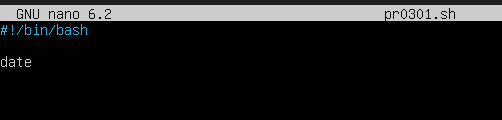
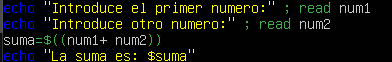
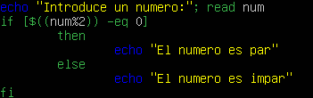
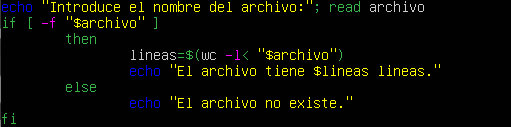
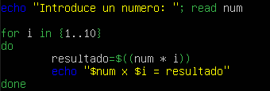
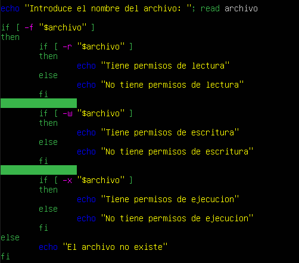
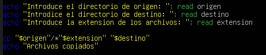
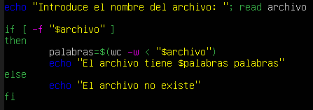
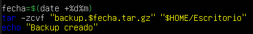

# PR0301: Primeros scripts en Bash

## Realiza las siguientes tareas

1. Crea un script que muestre por pantalla la fecha y la hora del sistema

    

2. Mejora el script anterior para que muestre un mensaje de la forma: “Hoy es jueves día 15 de abril y son las 12:00 horas”. Tendrás que mirar la ayuda del comando date para poder extraer las diferentes partes de la fecha y hora.

    

3. Crea un script que solicite la usuario dos números y luego imprima la suma de esos números

    

4. Crea un script que determine si un número introducido por el usuario es par o impar. Para realizar este ejercicio puedes utilizar el operador módulo, que es el símbolo %

    

5. Escribe un script que solicite el nombre de un archivo y luego imprima cuántas líneas tiene ese archivo. Verifica que el archivo exista antes de contar las líneas.

    

6. Escribe un script que imprima la tabla de multiplicar de un número introducido por el usuario.

    

7. Crea un script que solicite el nombre de un archivo y luego informe si el archivo tiene permisos de lectura, escritura y ejecución para el usuario actual.

    

8. Escribe un script que copie todos los archivos con una extensión específica desde un directorio de origen a uno de destino.

    

9. Escribe un script que cuente cuántas palabras hay en un archivo y las muestre en la terminal

    

10. Crea un script que comprima todos los ficheros del directorio Escritorio que está dentro del directorio personal del usuario actual en un fichero llamado backup.DDMM.gz donde DD es el día del mes y MM el mes. Para comprimir puedes utilizar el comando tar de la siguiente manera:

    ```python
    tar -zcvf nombre-archivo.tar.gz nombre-directorio
    ```

    
